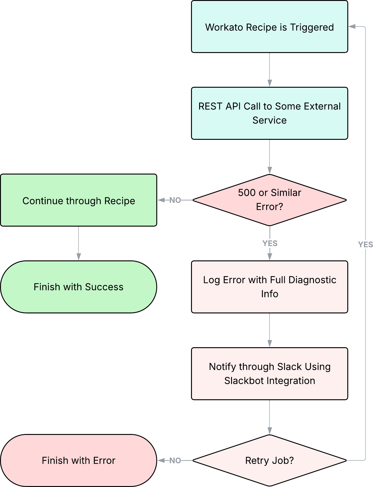

*Problem: Workato Recipes could fail for a multitude of reasons; we needed a way to be able to log, notify, and retry failed jobs.*

For some context, Workato is a cloud-based integration and automation platform (iPaaS: Integration Platform as a Service). It lets businesses connect different apps and automate workflows without needing heavy custom code. It leverages the growing demand for low-code/no-code solutions, allowing organizations to build and manage integrations more easily while supporting connections across virtually any platform to meet a wide range of business needs. Recipes are Workato’s solution to building automations: they are reusable, logic-based workflows that define triggers, actions, and conditions to orchestrate processes across apps.

At DynPro, we were specifically using Workato for a client project and needed a robust, fully integrated health-check system for our recipes. To address this, I developed an Autonomous Operations Framework: a structured, self-monitoring layer designed to maintain the stability, visibility, and operational scalability of our Workato integrations.

The framework evaluates recipe performance by tracking execution metrics, error patterns, and downstream system availability. When a failure is detected, it can automatically take corrective actions such as retrying recipes or resorting to fallback recipe workflows. For issues requiring human oversight, it generates proactive with diagnostics, delivered through the desired channel(s) (Slack in our case; I leveraged a Recipe with Slackbot integration).

Architecturally, the framework can be understood with the following flowchart:

 

 

By implementing this Autonomous Operations Framework, I significantly improved system resilience and reduced the need for manual monitoring. After implementing the AOF for the existing Recipes and standardizing its use in all future Recipes, the client gained a more stable and scalable integration ecosystem.

Here is some documentation and a small video guide on how to create a Workato Recipe, in case you are interested in low-code/no-code environments and/or Workato's Recipes specifically. [Recipe Documentation](https://docs.workato.com/en/getting-started/build-first-recipe.html).

<iframe src="https://www.youtube.com/embed/qRVJ5mky5hI" frameborder="0" allow="accelerometer; autoplay; clipboard-write; encrypted-media; gyroscope; picture-in-picture" allowfullscreen></iframe>

