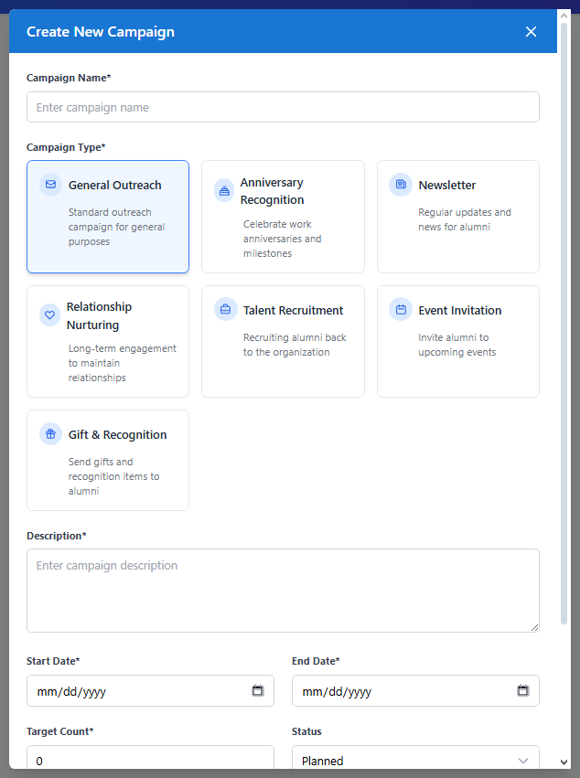
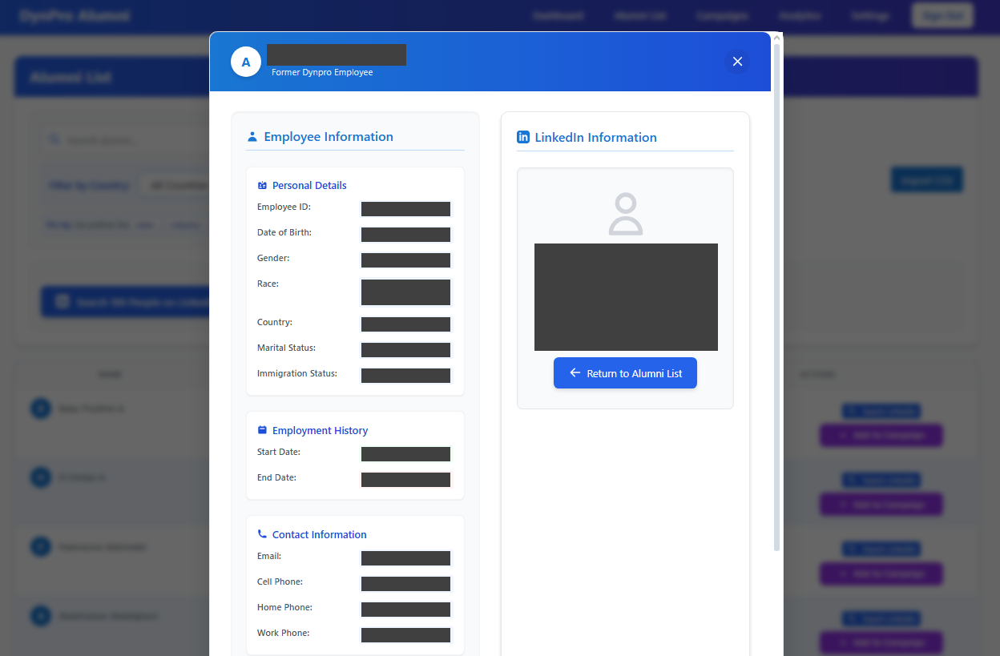
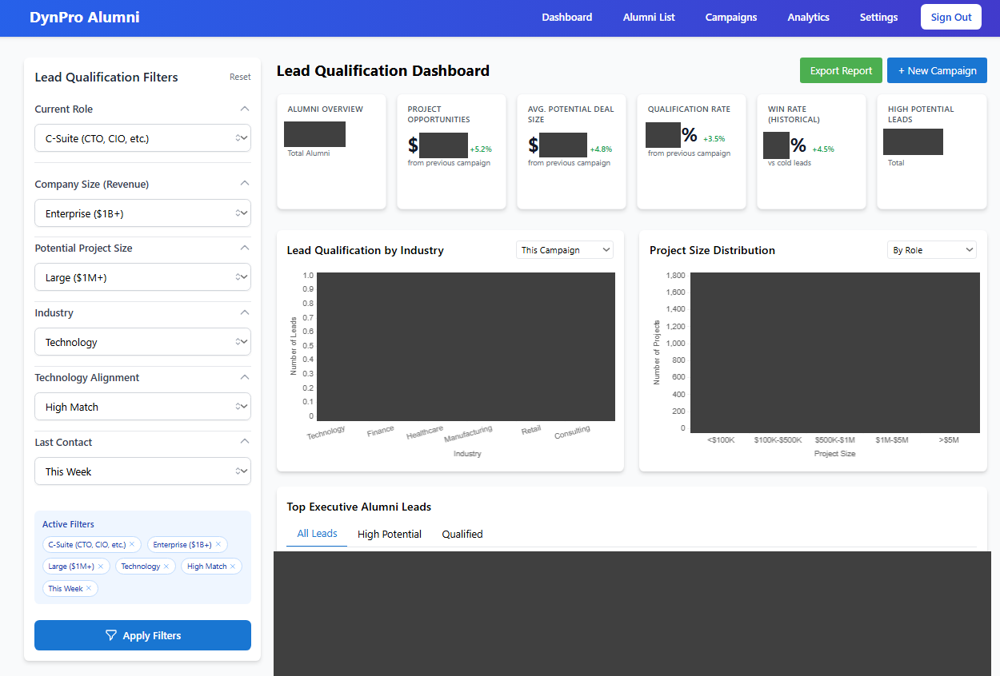

During the first week of my Summer 2025 internship, my team received a project handoff from one of our offshore groups. The deliverable was a bare-bones full stack application designed to find updated information of, and connect with, former company alumni. We were provided an outdated spreadsheet containing roughly two thousand records, and our goal was to build and deploy a production-ready platform that could support outreach efforts, prioritize high-value alumni, and help identify those most likely to drive new business opportunities.

I served as project lead for our team of three interns due to my experience with full stack development. I began by creating documentation for naming standards and Git workflow practices to streamline collaboration. We retained the frontend template selected by the previous team, but we rebuilt the backend and designed the outreach campaign workflow to allow organizers to group target alumni more effectively, contact them through multiple channels, and manage optional gift distribution.

*Outreach Campaigns*

The most critical component had never been attempted by the previous team. The spreadsheet only included basic information such as names, phone numbers (possibly outdated), and corporate email addresses. There was no reliable way to determine current roles, companies, or personal contact details. To close this gap, we conducted research and selected ProxyCurl’s LinkedIn web scraper (now discontinued) to acquire accurate, up-to-date data for every alumni. This data would comprise alumni profiles which could be viewed in a card format on the platform.

*Alumni Profile Card*

I defined the database schema, integrated the ProxyCurl API, and built a batch processing workflow that queried multiple alumni per request to save costs and increase efficiency. Once the pipeline was complete, we obtained personal email addresses and phone numbers (if available), current employers, and job titles for the entire dataset. This enriched information created a foundation for a more strategic outreach process. With validated company and title data, we designed an algorithm that scored alumni by seniority and organizational relevance, enabling our team to identify individuals with the highest probability of potential business opportunities.

While continuing to refine the backend and frontend, we implemented this ranking model by assigning higher weight to executive and senior-level positions and additional weight to well-known companies. The title remained the primary factor since it best indicated an alumni’s ability to initiate or approve project work. Additionally, we incorporated OpenAI's API to assist with accurate ranking.

*Ranking Algorithm*

### Scoring by Role:

**CEO**: 95 points
**C-suite (CTO, CFO, CIO, COO)**: 90 points
**President**: 90 points
**VP**: 85 points
**Director**: 80 points
**Head**: 75 points
**Manager**: 65 points
**Lead**: 60 points
**Senior**: 55 points
**Default**: 50 points

### Additional Adjustments:

**Random variation**: +0-4 points
**Leadership score bonus**: up to +5 points (from `leadershipScore` field)
**Capped at 100**

### Backend Leadership Score (AI-Generated)

Calculated by OpenAI on a scale of 1-7 (7 = executive level)
Stored in the `leadershipScore` field in the Alumni model
Used as a bonus in the frontend lead scoring

### Project Potential Multipliers

**CEO/CTO**: 3.0x multiplier
**VP**: 2.0x multiplier
**Director**: 1.5x multiplier
**Default**: 1.0x multiplier

After development was complete, I deployed the application to our company server. I configured DNS records, generated TLS and SSL certificates, and ensured all traffic was encrypted via HTTPS. The Node.js service was hosted behind NGINX and managed with PM2 to maintain uptime and provide real-time logs. I also administered the database and set appropriate access controls for authenticated users.

Following deployment, the platform enabled our Sales team to connect with several high-value alumni, ultimately resulting in multiple client engagements.

*Engagement Dashboard*

