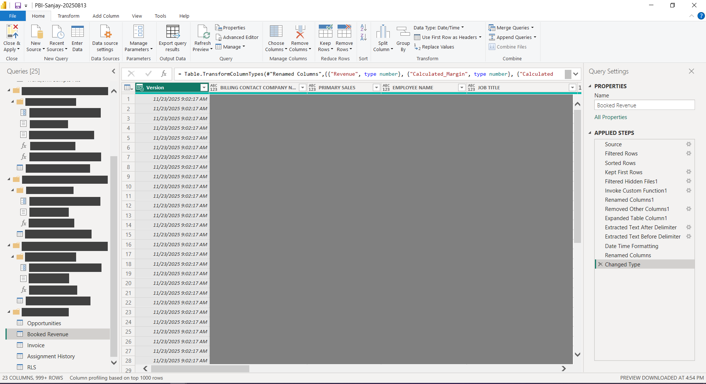
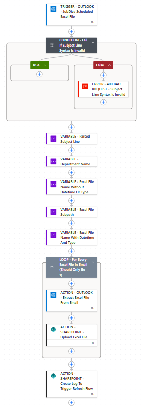
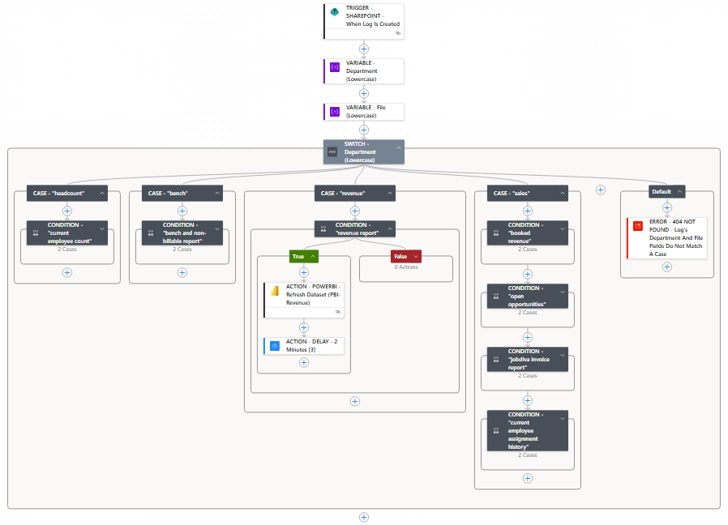
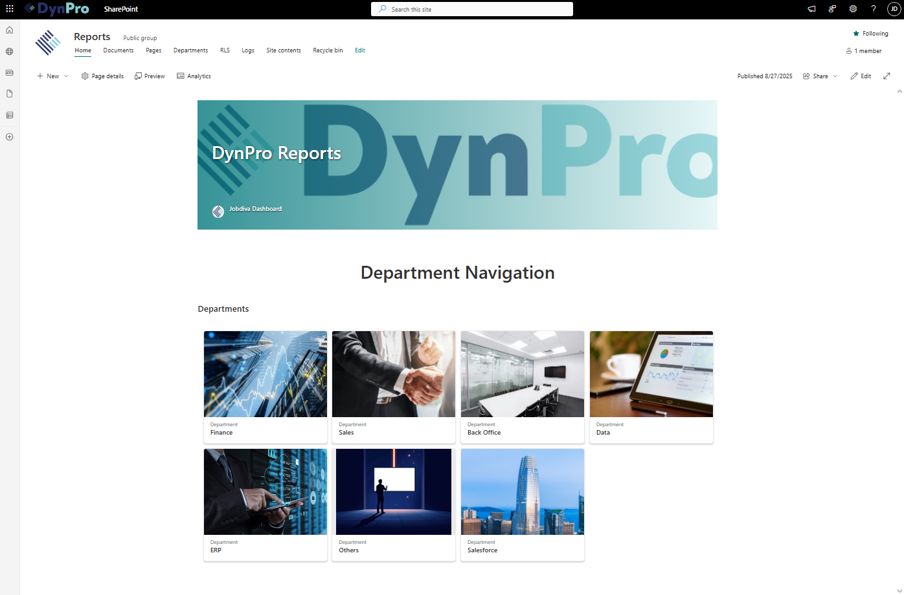
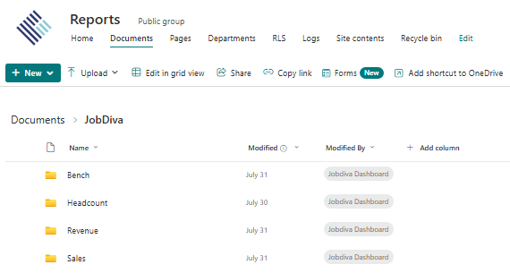
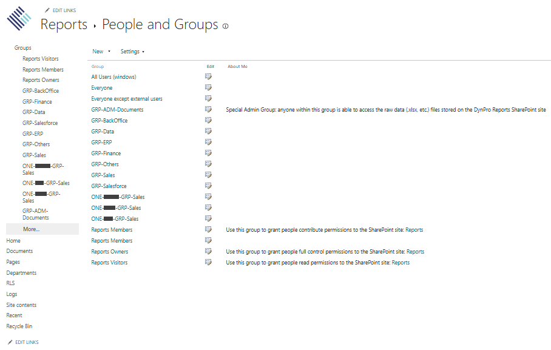

From [Investopedia](https://www.investopedia.com/terms/b/business-intelligence-bi.asp): "Business intelligence (BI) is a technology-driven process that turns business data into actionable insights. It can help executives and managers make better-informed decisions by analyzing and visualizing data trends."

So what happens when the platform we use to generate dashboards from reports (JobDiva) takes up to 10 minutes to generate even a simple graph? Slow dashboards meant slow insights, which meant slow action. For my final project, I was assigned to lead the effort to migrate the BI portion of JobDiva to a modern and scalable solution. We were given no direction, which allowed us to design the entire architecture and present a proposal to senior Sales and HR leaders who had long struggled with the inefficiency of JobDiva’s visualization tools.

Our team had deep experience with the Microsoft ecosystem. We had already used Azure for MSAL SSO in multiple internal applications, and the company relied on Outlook, Office 365, and Azure across daily operations. This made Power BI the logical choice for rebuilding the dashboard creation and publishing process. We still needed a user friendly frontend to house the reports, manage permissions, and centralize access. SharePoint was the natural extension since it provided structured document storage, strong group and permission controls, and direct Power BI integration.

The entire workflow was powered by Microsoft Power Automate. JobDiva would send out scheduled Excel reports to a designated Outlook inbox. Power Automate would capture those attachments, store them inside the appropriate SharePoint document library, and trigger Power BI to refresh the related dashboards. Our team designed, published, and embedded each required Power BI dashboard into SharePoint before scheduling the corresponding JobDiva report. This allowed us to build the pipeline in a controlled sequence and, as a bonus, become proficient with Power Query (M, Data Modeling), Power BI (DAX, Visualizating Data, Slicers), and advanced Excel.

*Power Query!*

I built two primary Power Automate flows. The first was an Upload flow that was triggered whenever a new report arrived in the Outlook inbox. It validated the attachment, uploaded the file into SharePoint, and wrote a structured log entry with the relevant metadata. This log served as the trigger for the second flow, the Refresh flow. The Refresh flow read the log details and refreshed the Power BI dashboards that depended on that specific report. This created a clean, automated, event-driven BI pipeline.

*Upload Flow*

*Refresh Flow*

I then organized the SharePoint frontend by department, placing each department’s dashboards on its own page. The final task was permission configuration. Each dashboard had to be visible only to the appropriate users or groups. SharePoint’s group and permission model made this straightforward once the backend site settings were understood. I configured all group memberships by email and validated that each department only saw the dashboards intended for them. This delivered the reliability, security, and user experience that our architectural design required.

*DynPro Reports*

*Reports Storage: SharePoint's Shared Documents Directory*

*Advanced Site Permissions: Groups*

